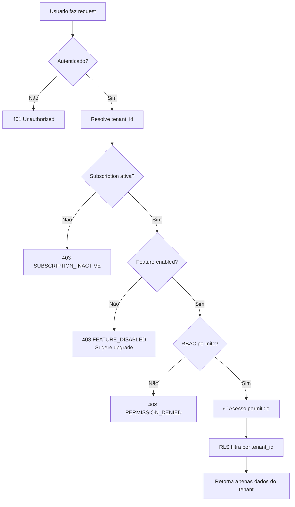

# 🏢 Arquitetura SaaS Multi-tenant - Obra360

## 📋 Visão Geral

O Obra360 é um **SaaS multi-tenant** com **2 camadas de administração**:

1. **Dev Admin** (Global) - Nós (desenvolvedores) - Controle total do produto
2. **Tenant Admin** (Por empresa) - Dono da construtora - Gerencia usuários e permissões

---

## 🏗️ Arquitetura de Multi-tenancy

### Modelo: **Single Database + Shared Schema + tenant_id**

```
┌─────────────────────────────────────────┐
│         ÚNICO BANCO POSTGRES            │
├─────────────────────────────────────────┤
│                                         │
│  Tenant 1 (Construtora A)               │
│  ├─ Users       (tenant_id = 1)         │
│  ├─ Projects    (tenant_id = 1)         │
│  └─ Clients     (tenant_id = 1)         │
│                                         │
│  Tenant 2 (Construtora B)               │
│  ├─ Users       (tenant_id = 2)         │
│  ├─ Projects    (tenant_id = 2)         │
│  └─ Clients     (tenant_id = 2)         │
│                                         │
└─────────────────────────────────────────┘
```

**Vantagens:**
- ✅ Escalável (milhares de tenants)
- ✅ Manutenção simples (1 banco)
- ✅ Backups unificados
- ✅ Custos reduzidos

**Isolamento:**
- 🔒 **Row Level Security (RLS)** - Postgres bloqueia queries sem tenant_id correto
- 🔒 **Middleware no backend** - Injeta tenant_id automaticamente
- 🔒 **Auditoria completa** - Todos os acessos logados

---

## 🎭 Camadas de Administração

### 1️⃣ DEV ADMIN (Global - Nós)

#### Responsabilidades:
- 🏢 **Gerenciar Tenants**
  - Listar todas as empresas
  - Ver status de assinatura
  - Ativar/suspender/cancelar
  
- 💰 **Gerenciar Assinaturas**
  - Trocar plano
  - Estender trial
  - Ajustar limites
  
- 🎛️ **Feature Flags**
  - Ativar/desativar módulos por tenant
  - Rollout gradual de features
  - Override de plano (dar acesso especial)
  
- 🛠️ **Suporte**
  - Impersonation (logar como usuário)
  - Ver logs completos
  - Debug de problemas

#### Tabelas Exclusivas:
```sql
-- Dev admins
saas_users (dev_admin, support)

-- Gerenciamento SaaS
tenants
subscriptions
plans
features
tenant_feature_overrides
support_session_logs
```

---

### 2️⃣ TENANT ADMIN (Por empresa - Cliente)

#### Responsabilidades:
- 👥 **Gerenciar Usuários**
  - Convidar novos usuários
  - Ativar/desativar contas
  - Atribuir roles
  
- 🔐 **Gerenciar Roles e Permissões**
  - Criar roles customizadas
  - Definir permissões granulares
  - Atribuir roles aos usuários
  
- ⚙️ **Configurações da Empresa**
  - Logo, nome, CNPJ
  - Preferências do sistema
  
- 📊 **Ver Assinatura** (read-only)
  - Plano atual
  - Limites e uso
  - Próximo vencimento

#### Tabelas Exclusivas:
```sql
-- Gestão de usuários (por tenant)
users
roles
role_permissions
```

---

## 🎯 Sistema de Feature Flags

### Como Funciona

**Regra de Ouro:**
```
Acesso a Recurso = (RBAC permite) AND (Feature enabled)
```

### Exemplo:

```javascript
// Usuário tem permissão PROCUREMENT:WRITE
user.permissions.includes('PROCUREMENT:WRITE') // ✅ true

// Mas o plano dele não inclui PROCUREMENT
subscription.features.includes('PROCUREMENT') // ❌ false

// RESULTADO: Acesso NEGADO
// UI mostra: "Faça upgrade para acessar Compras"
```

### Catálogo de Features

| Feature Key | Display Name | Categoria | Incluído em |
|-------------|--------------|-----------|-------------|
| `CRM` | CRM & Vendas | MODULE | Pro, Enterprise |
| `PROJECTS` | Gestão de Projetos | MODULE | Todos |
| `INVENTORY` | Estoque | MODULE | Starter, Pro, Enterprise |
| `PROCUREMENT` | Compras | MODULE | Pro, Enterprise |
| `FINANCE` | Financeiro | MODULE | Todos |
| `CONTRACTORS` | Empreiteiros | MODULE | Pro, Enterprise |
| `BUDGET_PDF` | Export PDF | ADD_ON | Pro, Enterprise |
| `REPORTS_EXPORT` | Export Excel | ADD_ON | Pro, Enterprise |
| `AI_CHAT` | Assistente IA | ADD_ON | Enterprise |
| `AI_RECEIPT` | IA Notas Fiscais | ADD_ON | Enterprise |
| `MOBILE_APP` | App Mobile | BETA | Custom override |
| `INTEGRATIONS` | Integrações | BETA | Custom override |

---

## 💰 Planos e Assinaturas

### Planos Disponíveis

#### 🆓 Starter (Trial)
- **Preço:** Grátis
- **Trial:** 14 dias
- **Limites:**
  - 3 usuários
  - 5 projetos
  - 2 GB storage
- **Features:**
  - PROJECTS
  - INVENTORY
  - FINANCE

#### 💼 Pro
- **Preço:** R$ 297/mês ou R$ 2.970/ano (2 meses grátis)
- **Limites:**
  - 10 usuários
  - 50 projetos
  - 20 GB storage
- **Features:**
  - CRM
  - PROJECTS
  - INVENTORY
  - PROCUREMENT
  - FINANCE
  - CONTRACTORS
  - BUDGET_PDF
  - REPORTS_EXPORT

#### 🏢 Enterprise
- **Preço:** R$ 997/mês ou R$ 9.970/ano
- **Limites:**
  - Usuários ilimitados
  - Projetos ilimitados
  - 100 GB storage
- **Features:**
  - Todas do Pro +
  - AI_CHAT
  - AI_RECEIPT
  - INTEGRATIONS
  - Suporte prioritário

---

## 🔐 RBAC (Role-Based Access Control)

### Roles Padrão

Cada tenant começa com 5 roles:

#### 1. **Admin** (Tenant Admin)
- Acesso total ao tenant
- Gerencia usuários e roles
- `is_tenant_admin = true`

**Permissões:**
```
CLIENTS:READ, CLIENTS:WRITE
PROJECTS:READ, PROJECTS:WRITE
INVENTORY:READ, INVENTORY:WRITE
PROCUREMENT:READ, PROCUREMENT:WRITE, PROCUREMENT:APPROVE
FINANCE:READ, FINANCE:WRITE, FINANCE:APPROVE
CONTRACTORS:READ, CONTRACTORS:WRITE
REPORTS:READ, REPORTS:EXPORT
USERS:READ, USERS:WRITE
ROLES:READ, ROLES:WRITE
```

#### 2. **Financeiro**
```
FINANCE:READ, FINANCE:WRITE
REPORTS:READ
```

#### 3. **Gestor de Obras**
```
PROJECTS:READ, PROJECTS:WRITE
INVENTORY:READ
CONTRACTORS:READ
```

#### 4. **Compras**
```
INVENTORY:READ, INVENTORY:WRITE
PROCUREMENT:READ, PROCUREMENT:WRITE
```

#### 5. **Vendas**
```
CLIENTS:READ, CLIENTS:WRITE
```

### Permissões Disponíveis

Formato: `RESOURCE:ACTION`

**Resources:**
- CLIENTS
- PROJECTS
- INVENTORY
- PROCUREMENT
- FINANCE
- CONTRACTORS
- REPORTS
- USERS
- ROLES

**Actions:**
- READ
- WRITE
- APPROVE (para workflows)

---

## 📊 Status da Assinatura

### Estados Possíveis

| Status | Descrição | Comportamento |
|--------|-----------|---------------|
| `trial` | Trial ativo | Acesso completo ao plano |
| `active` | Assinatura paga ativa | Acesso completo |
| `past_due` | Pagamento atrasado | Alerta, acesso mantido (configur.) |
| `suspended` | Suspenso (inadimplência) | Bloqueio de escrita, leitura ok |
| `canceled` | Cancelado | Bloqueio total |

### Bloqueios por Status

```javascript
// subscription.status === 'suspended'
// Resultado:
- ❌ Criar/editar dados
- ✅ Visualizar dados (read-only)
- ❌ Exportar relatórios
- ❌ Convidar usuários

// subscription.status === 'canceled'
// Resultado:
- ❌ Bloqueio total
- Mensagem: "Assinatura cancelada. Contate o suporte."
```

---

## 🛡️ Segurança - RLS (Row Level Security)

### Como Funciona

1. **Usuário faz login**
2. **Supabase retorna `auth.uid()`**
3. **Sistema busca `tenant_id` do user**
4. **RLS filtra TODAS as queries por `tenant_id`**

### Exemplo de Policy

```sql
-- Política para projetos
CREATE POLICY "Tenant isolation - projects" ON public.projects
  FOR ALL USING (tenant_id = get_user_tenant_id());

-- Função helper
CREATE FUNCTION get_user_tenant_id() RETURNS UUID AS $$
  SELECT tenant_id FROM public.users WHERE auth_user_id = auth.uid();
$$ LANGUAGE SQL SECURITY DEFINER;
```

**Resultado:**
- ✅ Usuário da Construtora A vê APENAS projetos da Construtora A
- ✅ Mesmo se fizer `SELECT * FROM projects` (sem WHERE)
- ✅ Postgres bloqueia automaticamente

---

## 🔍 Auditoria e Logs

### Audit Logs

Toda ação crítica é logada:

```sql
audit_logs (
  tenant_id,
  user_id,
  action,     -- CREATE_USER, UPDATE_ROLE, SUSPEND_TENANT
  entity_type, -- USER, ROLE, SUBSCRIPTION
  entity_id,
  old_values,
  new_values,
  ip_address,
  user_agent,
  created_at
)
```

**Ações logadas:**
- 👥 CRUD de usuários
- 🔐 CRUD de roles/permissões
- 💰 Mudanças de assinatura
- 🎛️ Feature overrides
- 🛠️ Sessões de suporte (impersonation)
- 🏢 Suspender/reativar tenant

### Support Session Logs

Quando Dev Admin faz impersonation:

```sql
support_session_logs (
  saas_user_id,          -- Quem do suporte
  tenant_id,             -- Em qual empresa
  impersonated_user_id,  -- Como qual usuário
  reason,                -- "Debug de erro X"
  started_at,
  ended_at,
  expires_at,            -- Max 15 minutos
  ip_address,
  actions_performed      -- ['READ_PROJECT', 'UPDATE_CLIENT']
)
```

---

## 🔧 Feature Overrides (Dev Admin)

### Casos de Uso

1. **Cliente Beta**
   ```sql
   INSERT INTO tenant_feature_overrides (
     tenant_id, feature_key, enabled, reason
   ) VALUES (
     'uuid-tenant', 'AI_CHAT', true, 'Cliente beta de IA'
   );
   ```

2. **Add-on Pago**
   ```sql
   INSERT INTO tenant_feature_overrides (
     tenant_id, feature_key, enabled, reason
   ) VALUES (
     'uuid-tenant', 'MOBILE_APP', true, 'Comprou add-on mobile'
   );
   ```

3. **Trial Estendido**
   ```sql
   INSERT INTO tenant_feature_overrides (
     tenant_id, feature_key, enabled, reason, expires_at
   ) VALUES (
     'uuid-tenant', 'REPORTS_EXPORT', true, 'Trial estendido', '2026-02-15'
   );
   ```

### Resolução de Features

```javascript
// Pseudo-código
function resolveFeatures(tenantId) {
  const subscription = getSubscription(tenantId);
  const plan = getPlan(subscription.planId);
  const overrides = getFeatureOverrides(tenantId);
  
  let features = [...plan.includedFeatures];
  
  // Aplicar overrides
  for (const override of overrides) {
    if (override.expiresAt && isExpired(override.expiresAt)) continue;
    
    if (override.enabled) {
      features.push(override.featureKey);
    } else {
      features = features.filter(f => f !== override.featureKey);
    }
  }
  
  return [...new Set(features)]; // Unique
}
```

---

## 🚦 Fluxo de Acesso a um Recurso



---

## 📝 Próximos Passos

### 1. Executar Migrations

```bash
# No Supabase Dashboard > SQL Editor

# 1. Migration principal (schema)
-- Copiar e executar: supabase/migrations/002_saas_foundation.sql

# 2. Seed data (dados iniciais)
-- Copiar e executar: supabase/seeds/001_initial_data.sql
```

### 2. Criar Conta de Teste

```sql
-- Será feito pelo signup normal
-- Cria automaticamente:
-- - Tenant
-- - Subscription (trial)
-- - User com role Admin
-- - Roles padrão
```

### 3. Implementar Frontend

**Próximas tasks:**
- [ ] Criar `AuthContext.tsx` considerando tenant_id
- [ ] Signup flow (criar tenant + subscription)
- [ ] Resolver features no frontend
- [ ] Middleware de permissões
- [ ] UI condicional por role
- [ ] UI de upgrade para features bloqueadas

---

## 🎯 Diferenciais da Arquitetura

✅ **Isolamento total** - RLS + tenant_id  
✅ **2 camadas de admin** - Dev Admin + Tenant Admin  
✅ **Feature flags flexíveis** - Plano + overrides  
✅ **RBAC granular** - Permissões personalizáveis  
✅ **Auditoria completa** - Rastreabilidade total  
✅ **Suporte seguro** - Impersonation com limite de tempo  
✅ **Escalável** - Milhares de tenants no mesmo banco  
✅ **Pronto para SaaS** - Assinaturas, limites, billing  

---

**Arquitetura pronta para escalar! 🚀**
